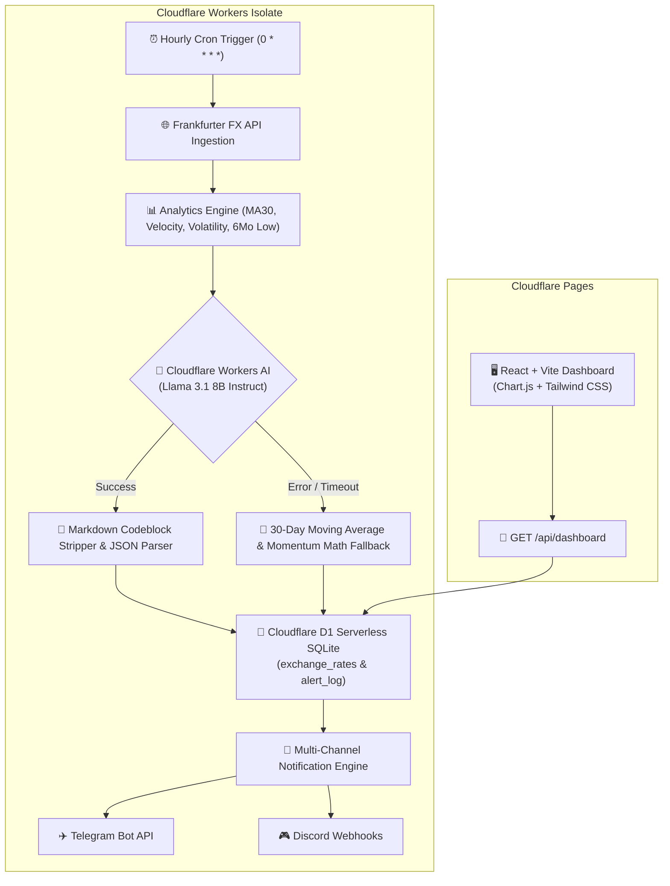

<div align="center">

# 🇮🇳 RupeeCheck-AI
### Real-Time USD/INR Edge Tracking & AI Low-Rate Forecasting

[](https://workers.cloudflare.com/)
[](https://developers.cloudflare.com/d1/)
[](https://developers.cloudflare.com/workers-ai/)
[](https://react.dev/)
[](https://www.typescriptlang.org/)
[](https://tailwindcss.com/)
[](./LICENSE)

<br />

> An enterprise-grade, serverless edge web application that tracks real-time USD/INR exchange rates, forecasts 30-day rate lows using edge LLMs, renders a live glassmorphism analytics dashboard, and dispatches automated multi-channel notifications to Telegram and Discord—operating entirely within Cloudflare's free tier.

</div>

---

## 📐 System Architecture



---

## 🧠 Engineering Highlights & Architecture Trade-offs

### 1. Edge Serverless Architecture
- **Zero Cold Starts:** Leverages Cloudflare Workers built on V8 isolates rather than traditional containerized Lambdas, eliminating startup latency and keeping execution under 5ms.
- **Global Data Proximity:** Static assets hosted on Cloudflare Pages globally distributed CDN with API worker logic executing at edge locations closest to the user.

### 2. AI Reliability & Deterministic Fallback Engine
- **Hybrid Prediction Pipeline:** Primary forecasting uses `@cf/meta/llama-3.1-8b-instruct` on Workers AI to evaluate 30-day price trends and generate natural language market rationales.
- **Guaranteed Zero-Null Failover:** If LLM inference times out, gets rate-limited, or returns non-conforming JSON, the system automatically falls back to a deterministic 30-day rolling moving average + momentum calculation. Database records and dashboard metrics are **never null**.

### 3. Quantitative Financial Analytics
- **Statistical Metric Suite:** Ingests 180 days of historical FX price action to compute 30-day simple moving averages ($MA_{30}$), 7-day rate velocity ($\Delta / 7\text{d}$), price volatility ($\sigma$), and 180-day minimum price floors.
- **Dynamic Floor Detection:** Evaluates whether current exchange rates hit or breach historical 6-month minimums, dynamically triggering alert headers without hardcoded rate thresholds.

### 4. Non-Blocking Multi-Channel Notification Engine
- **Parallel Dispatch:** Uses `Promise.allSettled` to execute concurrent asynchronous HTTP POST requests to Telegram Bot API and Discord Webhooks.
- **Audit Logging:** Logs delivery status (`success` | `failed`) along with formatted markdown payloads into D1 database `alert_log` table for observability.

---

## 🛠️ Tech Stack Matrix

| Layer | Technology | Primary Function |
|---|---|---|
| **Backend Compute** | Cloudflare Workers | Serverless V8 isolate execution, cron scheduling, HTTP API endpoints |
| **Database** | Cloudflare D1 | Serverless SQLite relational storage (`exchange_rates`, `alert_log`) |
| **AI / Machine Learning** | Cloudflare Workers AI | Llama 3.1 8B Instruct model running on Cloudflare edge GPUs |
| **Frontend Framework** | React 19 + Vite 5 | SPA with custom hooks, memoized components, type-safe data fetching |
| **Data Visualization** | Chart.js 4 + react-chartjs-2 | Interactive dual-series rate trajectory chart (History + AI Forecast) |
| **Styling** | Tailwind CSS 3 | Modern dark-mode UI with glassmorphic cards, glow badges, CSS animations |
| **Infrastructure / CLI** | Wrangler CLI 3 | Declarative bindings, local D1 SQLite emulators, secret management |

---

## 💻 Local Development Guide

### Prerequisites
- **Node.js**: `v18.0.0` or higher
- **npm**: `v9.0.0` or higher
- **Cloudflare Account**: Free tier wrangler login

### Step-by-Step Setup

1. **Clone & Install Dependencies:**
   ```bash
   git clone https://github.com/<your-username>/usdinr-monitor.git
   cd usdinr-monitor
   
   # Install Worker dependencies
   npm install
   
   # Install Frontend dependencies
   cd frontend && npm install && cd ..
   ```

2. **Configure Local Environment Secrets:**
   Copy `.dev.vars.example` to `.dev.vars` and add your test Telegram/Discord credentials:
   ```bash
   cp .dev.vars.example .dev.vars
   ```
   *Edit `.dev.vars`:*
   ```env
   TELEGRAM_TOKEN="YOUR_TELEGRAM_TOKEN"
   TELEGRAM_CHAT_ID="YOUR_TELEGRAM_CHAT_ID"
   DISCORD_WEBHOOK="https://discord.com/api/webhooks/YOUR/DISCORD_WEBHOOK_URL"
   ```

3. **Initialize Local Database:**
   ```bash
   npx wrangler d1 execute usdinr-db --local --file=./schema.sql
   ```

4. **Start Local Development Servers:**
   ```bash
   # Terminal 1 — Worker API Backend (localhost:8787)
   npx wrangler dev

   # Terminal 2 — React Dashboard (localhost:5173)
   cd frontend && npm run dev
   ```

5. **Trigger Local Cron Manual Execution:**
   ```bash
   curl -X POST http://localhost:8787/__trigger_cron
   ```

---

## 🚀 Production Deployment

### 1. Create Cloudflare D1 Database
```bash
npx wrangler d1 create usdinr-db
```
*Update `database_id` in `wrangler.json` with the returned database ID.*

### 2. Apply Production Database Schema
```bash
npx wrangler d1 execute usdinr-db --file=./schema.sql
```

### 3. Set Production Environment Secrets
```bash
npx wrangler secret put TELEGRAM_TOKEN
npx wrangler secret put TELEGRAM_CHAT_ID
npx wrangler secret put DISCORD_WEBHOOK
```

### 4. Deploy Backend & Frontend
```bash
# Deploy Cloudflare Worker Backend
npx wrangler deploy

# Build & Deploy React Frontend to Cloudflare Pages
cd frontend
npm run build
npx wrangler pages deploy dist --project-name=usdinr-monitor
```

> **Cloudflare Pages Environment Variable:**
> Configure `VITE_API_URL` in Cloudflare Pages dashboard (Settings → Environment Variables) pointing to your deployed Worker API URL (e.g. `https://usdinr-monitor.<your-subdomain>.workers.dev`) for seamless API resolution.

---

## 🔒 Security & Privacy Considerations

- **Secret Isolation:** Environment keys (`TELEGRAM_TOKEN`, `DISCORD_WEBHOOK`) are injected at runtime via Cloudflare Environment Bindings and `.dev.vars`. No raw keys exist in source control.
- **Git Hygiene:** Root `.gitignore` explicitly excludes `.dev.vars`, `.env*`, `.wrangler/`, build directories (`dist/`, `build/`), and system logs.
- **CORS Safety:** API endpoints strictly return standardized CORS headers for browser compatibility.
- **Database Sanitization:** SQL queries use parameterized binding via D1 Prepared Statements to prevent SQL injection vulnerabilities.

---

## 📄 License

Distributed under the MIT License. See `LICENSE` for details.
