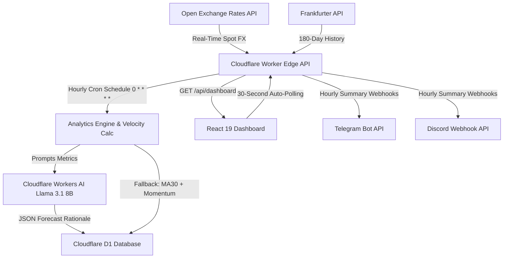

<div align="center">

# 💵 RupeeCheck-AI
### Real-Time 24/7 USD/INR Spot Tracking, Edge AI Forecasting & Multi-Channel Alert Engine

[](https://react.dev/)
[](https://workers.cloudflare.com/)
[](https://developers.cloudflare.com/d1/)
[](https://developers.cloudflare.com/workers-ai/)
[](https://vitejs.dev/)
[](https://tailwindcss.com/)
[](https://github.com/impeccable/impeccable)

An enterprise-grade, 100% free-tier serverless edge application that monitors real-time USD/INR exchange rates, projects 30-day rate minimums using edge LLMs with deterministic mathematical fallbacks, and dispatches automated hourly summaries to Telegram and Discord.

</div>

---

## 🏗️ System Architecture



---

## ✨ Core Features

* **24/7 Real-Time Spot Polling:** Instant USD/INR spot rates fetched dynamically from Open Exchange Rates API with 30-second client-side auto-polling.
* **Edge LLM Intelligence:** Powered by Meta's `@cf/meta/llama-3.1-8b-instruct` on Cloudflare Workers AI for 1-hour market summaries and target rate projections.
* **Deterministic Fallback Pipeline:** Zero-downtime guarantee utilizing a rolling 30-day moving average and 7-day rate momentum if AI execution times out.
* **Impeccable Dark Glassmorphism UI:** Built with React 19, Vite 8 (Rolldown bundler), and Tailwind CSS v4, audited against WCAG AA color contrast standards.
* **Multi-Channel Alert Dispatcher:** Automated hourly market updates delivered directly to Telegram and Discord channels.
* **100% Free Tier Optimized:** Efficient architecture remaining well under Cloudflare Free Tier daily execution limits.

---

## 🛠️ Technology Stack Matrix

| Component | Technology | Role |
| --- | --- | --- |
| **Compute** | Cloudflare Workers (TypeScript) | Edge API & Cron Trigger Execution |
| **Database** | Cloudflare D1 | Serverless SQLite for Rate Snapshots & Alert Logs |
| **AI Engine** | Workers AI (Llama 3.1 8B Instruct) | Market Analysis & Lowest Rate Predictions |
| **Frontend** | React 19 + Vite 8 + Tailwind v4 | High-Contrast Glassmorphism Dashboard |
| **Design Audit** | Impeccable Design Harness | Automated UI/UX Anti-Pattern & Accessibility Checks |
| **Spot Data** | Open Exchange Rates API | Real-Time FX Rates |
| **Historical Data** | Frankfurter Exchange Rate API | 180-Day Daily Historical FX Rates |
| **Notifications** | Telegram Bot API & Discord Webhook | Hourly Summary Delivery |

---

## 🚀 Quick Start & Local Development

### 1. Prerequisites

* Node.js `^22.0.0`
* npm `^10.0.0`
* Cloudflare Wrangler CLI `v4.x`

### 2. Backend Setup

```bash
# Clone the repository
git clone https://github.com/SubharupBiswas/RupeeCheck-AI.git
cd RupeeCheck-AI

# Install backend dependencies
npm install

# Create local secrets file (Copy example)
cp .dev.vars.example .dev.vars
```

Edit `.dev.vars` with your API credentials:

```env
TELEGRAM_TOKEN="YOUR_TELEGRAM_BOT_TOKEN"
TELEGRAM_CHAT_ID="YOUR_TELEGRAM_CHAT_ID"
DISCORD_WEBHOOK="YOUR_DISCORD_WEBHOOK_URL"
```

### 3. Frontend Setup

```bash
cd frontend

# Install frontend dependencies
npm install

# Start local development server
npm run dev
```

---

## 📦 Deployment Instructions

### Deploy Cloudflare Worker Backend

```bash
# Apply D1 schema migration
npx wrangler d1 execute usdinr-db --file=./schema.sql

# Set production secrets
npx wrangler secret put TELEGRAM_TOKEN
npx wrangler secret put TELEGRAM_CHAT_ID
npx wrangler secret put DISCORD_WEBHOOK

# Deploy worker
npx wrangler deploy
```

### Deploy Frontend to Cloudflare Pages

1. Connect your GitHub repository to **Cloudflare Pages**.
2. Configure build settings:
* **Framework preset:** `Vite`
* **Build command:** `npm run build`
* **Build output directory:** `dist`
* **Root directory:** `frontend`

3. Add Environment Variable in Pages Dashboard:
* `VITE_API_URL` = `https://api-rupee.subnetmask.tech` (or `https://<YOUR_WORKER_SUBDOMAIN>.workers.dev`)

4. Configure Domain Isolation (Optional Custom Domains):
* **Frontend SPA Custom Domain:** `rupee.subnetmask.tech` (Cloudflare Pages)
* **Backend API Custom Domain:** `api-rupee.subnetmask.tech` (Cloudflare Worker)

---

Built with Cloudflare Workers AI & Impeccable UI/UX Standards
